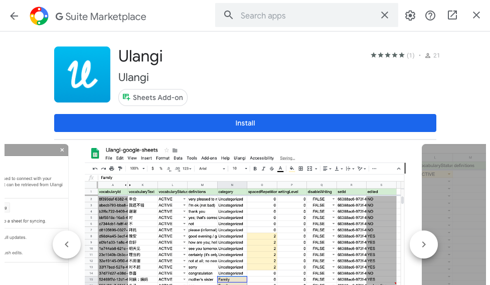

# Installing Ulangi for Google Sheets

#### Difficulty: Easy
Note: this add-on only works on Google Sheets web version (not the mobile version.)

## I. Installation

1. Create a Google Sheets document by visiting [https://sheets.google.com](https://sheets.google.com)

2. On the menu, select **Add-on > Get add-ons**.

3. Search **Ulangi** and install it.
  

4. On Permission dialog, click **Allow** button.

---
## II. Setup

1. After the installation, go to **Add-on > Ulangi > Show sidebar.**

2. Log in with your Ulangi account

3. Select a set you want to sync.

4. You're done! To download your data, click on the **Pull** button. To upload new changes, click on the **Push** button.

#### TIP:
If you want to set up another set for syncing, create a new document and repeat step 1 - 3.

---
## Important 
{: .text-red-200}
- Your login credential is stored within the document. If you share the document with someone else, they will have the ability to edit your data.

- This add-on is optimized to sync with one Ulangi account only. **Sharing and collaborating between multiple users are not yet supported by this add-on.**{: .text-red-200}
