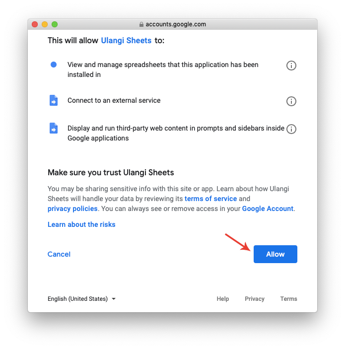

# How to install Ulangi Sheets Add-on

#### Difficulty: Easy

## I. Installation
1. Create a Google Sheets document by visiting [https://sheets.google.com](https://sheets.google.com)

2. On the menu, select **Add-on > Get add-ons**.

3. Search **Ulangi Sheets** and install it.

4. On Permission dialog, click **Allow** button.
  

---
## II. Setup

1. Go to **Add-on > Ulangi Sheets > Show sidebar.**

2. Click on **Set API key**. Copy and paste your API key from Ulangi app.

3. Click on **Set up for syncing** and select a set to sync.

4. You're done! To download your words, click on **Pull**. To upload, click on **Push**.

#### TIP:
If you want to set up another set for syncing, create a new document and repeat step 1 - 3.

---
## Important 
{: .text-red-200}
- The API key is stored with the document. If you share the document with someone else, they will have the ability to edit your flashcards.

- This add-on is optimized to sync with one Ulangi account only. Please do not set API key from multiple accounts within the same document. **Sharing and collaborating between multiple users are not yet supported by this add-on.**{: .text-red-200}
