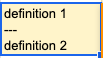
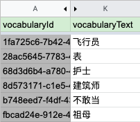

## How to use Ulangi Sheets Add-on

### Inserting terms
To insert a new term, just fill in the last empty row. The add-on will also automatically fill in default values for that row. Press **PUSH** to upload the term.

---
### Deleting terms
To delete terms, you must set **vocabularyStatus** to **DELETED**. Deleting the rows directly will not have any effects.

---
### Inserting multiple definitions
To insert multiple definitions, put three consecutive hyphens (```---```) in between them. The hyphens must be on its own line (see image below.)



#### TIP: How to go to a new line in a cell:
- On **Windows/Linux/Chrome OS**, press ```Ctrl + Enter```
- On **Mac**, press ```Command + Enter```

---
### Viewing original values or edit history.
By default, columns that contain original values are hidden because you should not modify them by yourself.

Click on arrows between columns A and K to show original columns (see image below.)



#### TIP:
- To hide original columns, choose *Add-ons > Ulangi Sheets > Hide original columns.*
- To view edit history, right-click on the target cell and choose **Show edit history.**

---
### Reset syncing
If something goes wrong, you can always delete the sheet then click **Set up for syncing** to start over.

---
### Things to keep in mind
{: .text-red-200}
- Stop syncing (**PULL/PUSH**) first if you want to edit multiple rows to prevent conflicts.
- Do not rearrange columns.
- Do not modify values of any gray cells.
- Do not to undo **PULL**. It will not re-download terms that you undo.

