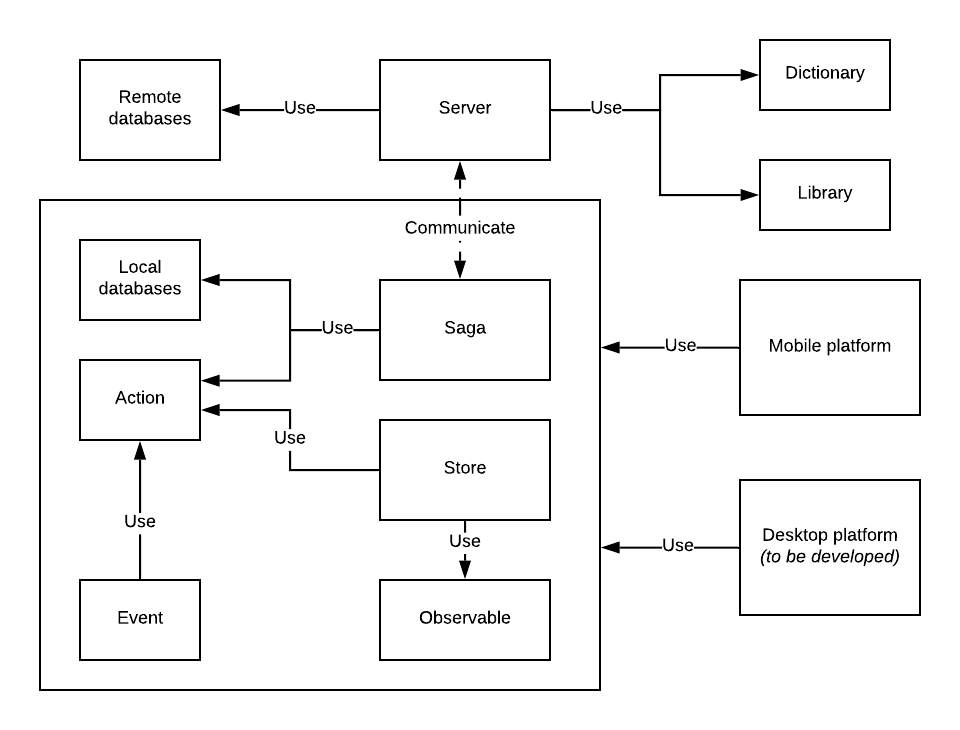

# Ulangi Documentation
## Project management
We use **monorepo ([Lerna](https://github.com/lerna/lerna))** to manage Ulangi project; that is, everything about Ulangi is hosted within a single repository. This makes it easy to reuse code across multiple platforms and to track related issues.

---

## Technology stack
- **React Native** for mobile app.
- **Electron** for desktop app *(to be developed)*.
- **NodeJS** for server-side and CLI scripts.
- **TypeScript** for Google Sheets add-on.

---

## Dependency diagram

---

## Getting started
What do you want to customize or contribute?
- [Mobile app]({{ site.baseurl }}/mobile-app/)
- [Server side]({{ site.baseurl }}/server-side/)
- [CLI scripts]({{ site.baseurl }}/cli-scripts/)
- [Google Sheets add-on]({{ site.baseurl }}/google-sheets-add-on/)

